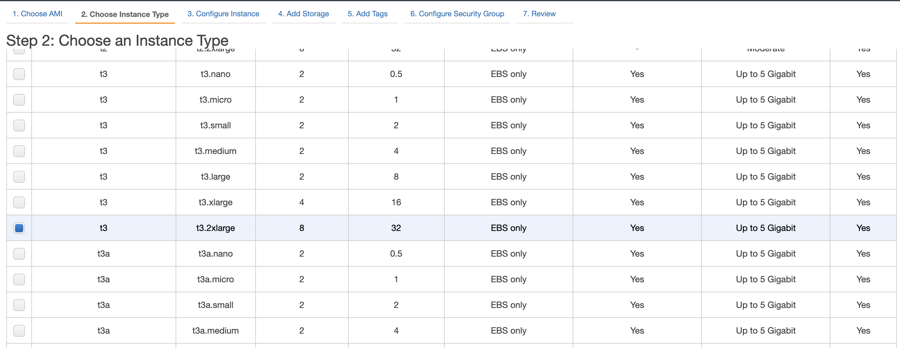
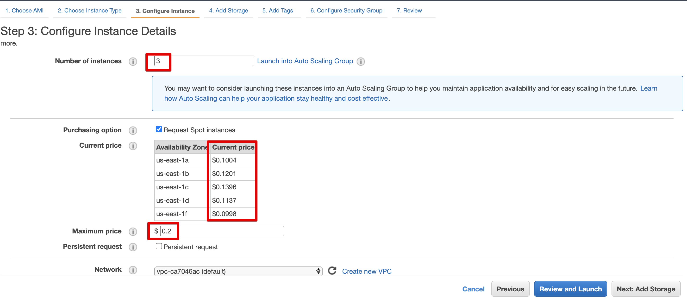
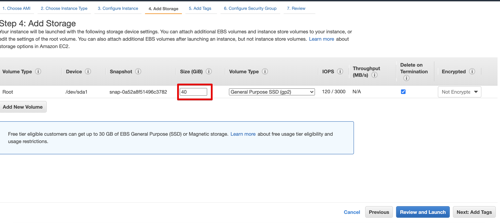
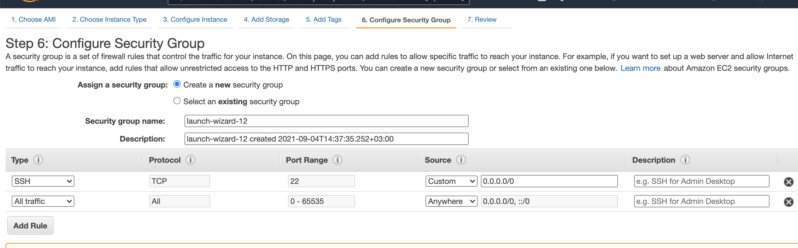
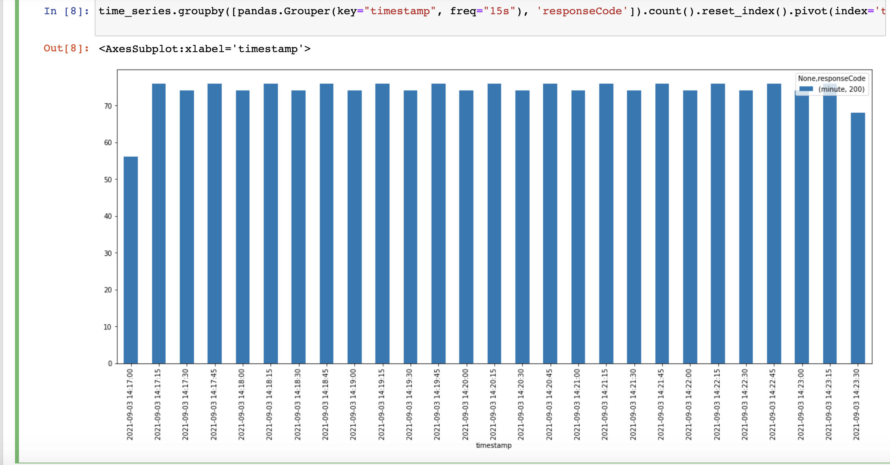

Recently i needed to perform stress test testing on one of my projects. I needed to simulate user interactions at a high scale and determine the exact breaking point of the application. Now, there are a lot of tools to do that, you even have cloud-based solutions that can do a lot of things for your $. Being an engineer i rejected such tools an was determined to create my own cloud testing stand, in additon i heard a lot about new aws instances type - [Amazon EC2 Spot Instances](https://aws.amazon.com/ec2/spot/?cards.sort-by=item.additionalFields.startDateTime&cards.sort-order=asc&trk=ps_a134p000006vwFnAAI&trkCampaign=acq_paid_search_brand&sc_channel=PS&sc_campaign=acquisition_RU&sc_publisher=Google&sc_category=Cloud%20Computing&sc_country=RU&sc_geo=EMEA&sc_outcome=acq&sc_detail=aws%20ec2%20spot%20instances&sc_content=EC2%20Spot_e&sc_matchtype=e&sc_segment=517625976421&sc_medium=ACQ-P|PS-GO|Brand|Desktop|SU|Cloud%20Computing|EC2%20Spot|RU|EN|Text&s_kwcid=AL!4422!3!517625976421!e!!g!!aws%20ec2%20spot%20instances&ef_id=Cj0KCQjwssyJBhDXARIsAK98ITS8mlje2FSiwzFXLeb9sFO-7OLtgi6GyIm0371n6GPjMeRmkfJ6DEAaAlRTEALw_wcB:G:s&s_kwcid=AL!4422!3!517625976421!e!!g!!aws%20ec2%20spot%20instances). Spot instances are instances that consisted of leftovers of ec2 platform, eg amazon is running its huge servers to provide ec2 facilities and they don't always used for 100%. That's where you can save a lot of money if your setup does not require real-time availability. The catch here is that these leftovers can be claimed by aws at any time and your cheap t3.2xlarge instance will just go poof and be removed. Now, that can be addressed by enabling persistent support for additional $ and other settings but that's a topic for another blog post.

## Stress test conditions

I needed to perform a stress test with a sequence of requests written before by jmeter proxy requests. I needed at least 1000 active users in a span of a minute. In addition to api interaction, these scripts also required downloading large(5+Mb) static assets. After some manual testing, i determined i need at least `t3.2xlarge` server, preferably 2 of them. Jmeter is not the most efficient tool in terms of resource consumption, there are other ones like, for example [tsung](http://tsung.erlang-projects.org/) that can do it much more efficiently, but jmeter was the easiest one to use and spot instances allows you to not think a lot about consumed resources.

## Cluster server creation

- First step go to ec2 page and press `Launch instances`, then select preferably os type, i choose Ubuntu 20 for its simplicity of configuration.
- Choose your instance size, as described above, i needed at least 20Gb of memory so i decided to go with `t3.2xlarge`(8 cpu and 32 Gb of memory)

- Next, you need to actually tell amazon that you want to use spot instance: . We will be using 3 instances - one will work as jmeter master and results collector and the other will perform the actual testing. `t3.2xlarge` instance size for jmeter master is a little overkill, but again, i did not want to spend a lot of time on configuration. Check `Request spot instances` checkbox. After you check this option you will see the actual current prices for specified regions. Spot instances have floating pricing and can change depending on the time of the day and aws loading. In order to not blow up your budgets, you need to specify the maximum hourly price you are willing to pay for each instance. If your instance overcomes such price it will be terminated. For simplicity just set it 2 times the pricing of the current price, that will be more than safe.
- Add some storage for the server. Jmeter uses static heap files for its testing, 1000 concurrent users with assets download will require at least 10Gb of disk storage, so we add 40 Gb disk.

- Skip tags step, go to 6th step: security settings. This is an important step for our setup. Because we are going to use Jmeter in cluster mode we need to open specific ports in order for the master and its cluster servers to communicate with each other and to servers to pass their test results back to the master. . Now i must warn you that the setting i use there is quite dangerous and you should never set up your production server as described above, but because i was going to use these servers for no more than 30m minutes and then just terminate them i decided to not bother with security group configuration and just allowed all incoming traffic to the servers, you should definitely use aws security groups for your production servers.

## Server confuration

After that, i got 3 servers preparing to launch i wrote a simple ansible role to actually configure these servers and load all necessary files.

```yaml
---
- name: Install openjdk
  apt:
    name: openjdk-16-jre
    state: present
    update_cache: yes
  become: yes

- name: Install unzip
  apt:
    name:  unzip
    state: present
  become: yes

- name: Download and Unarchive jmeter
  ansible.builtin.unarchive:
    src: https://dlcdn.apache.org//jmeter/binaries/apache-jmeter-5.4.1.zip
    dest: /home/ubuntu/
    remote_src: yes

- name: Copy jmeter configs and binaries
  copy: src={{ item }} dest=/home/ubuntu/apache-jmeter-5.4.1/bin/{{ item }} owner=ubuntu group=ubuntu
  with_items:
    - jmeter
    - jmeter.properties

- name: Create stress_test dir
  file:
    state: directory
    path: /home/ubuntu/stress_test

- name: Copy jmeter script xml
  copy: src=requests.jmx dest=/home/ubuntu/stress_test/requests.jmx owner=ubuntu group=ubuntu

- name: Copy seed csv
  copy: src=logins.csv dest=/home/ubuntu/stress_test/logins.csv owner=ubuntu group=ubuntu
```

Let's look into each step and see what there are doing. `Install OpenJDK` uses apt to install Java 16 environment to the server. We are going to download jmeter from the official site, unzip it and overwrite some config files. `Install unzip` is required for handling zip files. `Download and Unarchive jmeter` is used to download jmeter script and unzip it into the desired location. `Copy jmeter configs and binaries` is used to tweak our JMeter settings and optimize them. Custom `JMeter` file is used because of memory settings, by default JMeter uses a very small heap size equal to just 1Gb, if you do not change this item you will get `Out of heap` error if you try to simulate a large number of requests, so we are changing this line:

```diff
-: "${HEAP:="-Xms1g -Xmx1g -XX:MaxMetaspaceSize=256m"}"
+: "${HEAP:="-Xms24g -Xmx24g -XX:MaxMetaspaceSize=256m"}"
```

`jmeter.properties` tells jmeter to disable ssl support completely(again we are using this one for simplicity):

```diff
-#server.rmi.ssl.disable=false
+server.rmi.ssl.disable=true
```

Next, we are creating a results directory and actually copying the test `jmx` xml file and our users seed list(`Copy seed csv`) which is just a list of user credentials to use in order for login.

Next let's actually deploy our settings and assets to our servers:

```sh
$: ansible-playbook -i hosts jmeter_node.yml
```

## Cluster testing

Our servers are all set up and ready for action. Here is lying the final catch. If you try to launch `jmeter-server` on ec2 node you will receive a warning in the log file that it started to use internal ec2 node ip that is configured as the hostname for our servers and as such there will be problems with external requests and configuring servers to run the test. You actually need to use here your public ips:

```sh
$: ./jmeter-server -Djava.rmi.server.hostname=%{YOUR_PUBLIC_IP}
```

Again, if you have configured security groups for your servers you dont need such settings at all.

And the final step: launch testing on the cluster and write results into `/home/ubuntu/stress_test/results` folder and track the progress in `/home/ubuntu/stress_test/results/main.csv` file:

```sh
mkdir -p /home/ubuntu/stress_test/results && \
	 	 ./jmeter -Djava.rmi.server.hostname=%{YOUR_PUBLIC_IP} \
		-R ec2-1-*.compute-1.amazonaws.com,ec2-2-*.compute-1.amazonaws.com -n \
		-t /home/ubuntu/stress_test/requests.jmx -l /home/ubuntu/stress_test/results/main.csv \
		-e -o /home/ubuntu/stress_test/results
```

After the test is started you can track you progress through `main.csv` results file. In essence, it's just a csv file that gets its line appended by cluster servers periodically.

Pandas is a perfect instrument to interpret your test results:

```python
import pandas
import matplotlib.pyplot as plt

stress = pandas.read_csv('main.csv')
stress['timestamp'] = pandas.to_datetime(stress['timeStamp'],unit='ms')
time_series = stress.loc[stress['label'].isin(['Login request']), ['timestamp', 'responseCode']]
time_series\
  .groupby([pandas.Grouper(key="timestamp", freq="15s"), 'responseCode'])\
  .count()\
  .reset_index()\
  .pivot(index='timestamp', columns='responseCode')\
  .plot(kind="bar", figsize=(20,8), stacked=True)

```

Here i took the result csv downloaded from the server, converted its unix timestamp column into datetime then created data frame with timestamp/response code count grouped by each 15 seconds and then displayed a plot using `matplotlib.pyplot`:



Easy as it can be

## Conclusion

Aws spot instances is a great tool if you don't need constant availability. It's perfect for stress testing, CI builds and even beats lambda if you need to process a large number of tasks asynchronously.