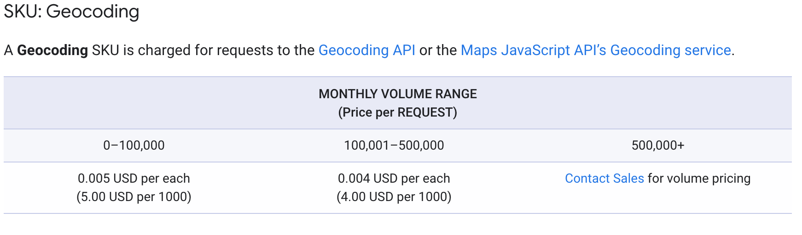
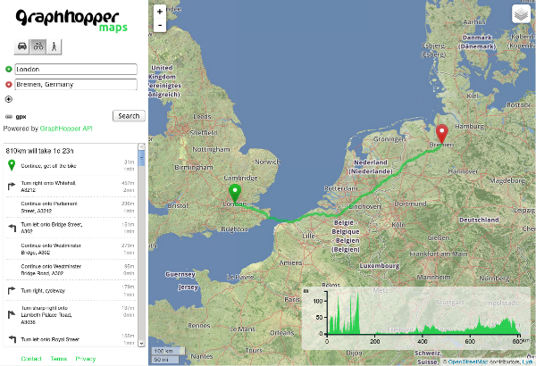
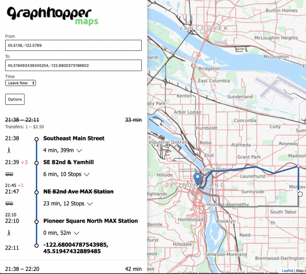
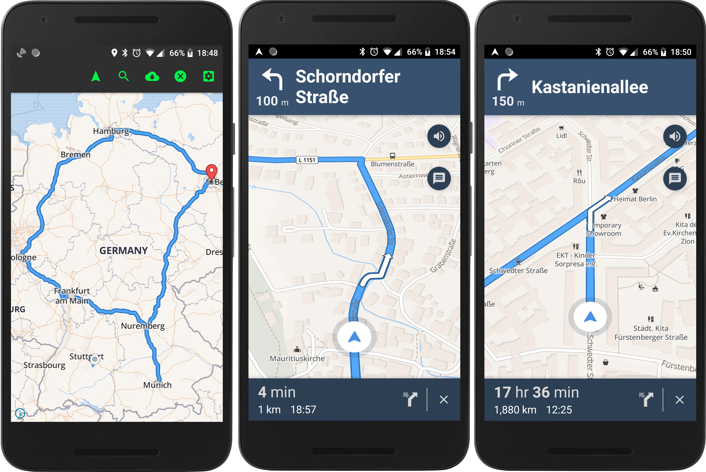

This will be a series of long articles, so stay tuned in for the next posts. I will be talking about hosted solutions to work with large geocode data. This all started as a simple task back in the dreaded 2020. The task was like this: hey, can we parse a list of European cities and determine which one can be a good candidate for search optimization. The file itself was a list of European cities without England, mostly west Europe, and consisted of 33000 entries. In essence, the task was to take each city and combine it with other entries from this file and check with Google keyword planner if this combination can be a good option to search optimization. Simple mathematics gives us the total number of permutations from such number of entries:

```python
import math
math.perm(33000, 2) # 1_088_967_000
```

That's more than 1 billion entries to process! There is no way that Google keyword planner will process the such number of entries in time. It was obvious, that we need to shrink that value by a lot, but how we can do that?

## Can i travel to it?

We had a lot of permutations. It was obvious that we don't need all these values. So i took a sample of 5000 entries from the permutation list and run them through Google planner to determine what combination can be safely omitted. After i received the results and checked it manually, the task started to obtain its form. Turned out that most of the routes that cant be performed by land traffic usually have no search requests.

## Take 1, use third party api

So, we had a list of routes and we need to determine what routes can be done by land traffic. Obviously, if you can travel from point A to B you can perform the same route but backward, so we need only half of the permutations. That's 500 million entries to process. Still, a very large number. My first guess was to use google api to parse all these routes. That was a moment when i fully understand the enterprise costs of such services.



4$ per 1000 requests! And that's only 500_000 requests, for more numbers you need to contact sales! Same picture with other providers. To get things even worse, each provider has its rate limits, google geocode won't allow you to perform more than 50 requests per second. 500 million requests are just too much to handle by third-party geocode services.


## Take 2, maybe python?

Surely, this task was encountered before, there should be some handy python library to tackle it right? As it turns out, it is, kind of. I present you - [Shapely](https://pypi.org/project/Shapely/). Shapely is a marvelous python package, that allows you to work with planar geometric objects, construct paths and determine if polygon contains some point. Here is an example of building an area from coordinates and determing if point is inside this area:

```python
import shapely.geometry
import shapely.geometry.polygon

coords = [
  (81.434750, -5.863332),
  (74.786230, -6.704456),
  (62.807440, -34.492960),
  ....
  (81.434750, -5.863332)
]
EUROPE_POLYGON = shapely.geometry.polygon.Polygon(coords)

p1 = shapely.geometry.Point(-20.0302976, -44.1650444)
EUROPE_POLYGON.contains(p1)
```

The library is very simple to use, but it turned out that we can't actually determine if we two points actually have routes between them in Europe. More than that, we also need to take into account the time needed to perform each travel, because, can travel from Copenhagen to Malagawhich but it will take more than 24 hours to finish, so we don't actually need such route either. We definitely need some more complex solution.

## Take 3, open street maps

During my work with shapely, i needed a list of coordinates that described the area of Europe. After some research, i found out that there is an open-source project that can give me that and much more - [open street map](https://www.openstreetmap.org/). Open street map(OSM) project targets the creation of a free editable map of the whole world. Its just like Wikipedia, but for maps. OSM has a collection of different areas available to be downloaded as used as you like. Also, there is a technical standard for geocoded data. There is a number of applications and libraries that can use OSM datasets:
- [valhalla](https://github.com/valhalla/valhalla)
- [osrm-backend](https://github.com/Project-OSRM/osrm-backend)
- [graphhopper](https://github.com/graphhopper/graphhopper)
- [pgrouting](http://docs.pgrouting.org/2.3/en/doc/src/tutorial/index.html)

valhalla and osrm-backend are both written in C++, need some compilation in order to work and has some complicated set up and mostly used as cli tools. Pgrouting is a psql plugin, so in order to work with large datasets, like Europe whole map will require some sirious tweaks. Graphhopper is the most intersting one from this list. It is a Java backend appliction with ready to use server and the frontend part with routing possilbities. Its ready to use google map like hosted solution.







And the setup itself is [piece of cake](https://github.com/graphhopper/graphhopper/blob/master/docs/core/quickstart-from-source.md):

```shell
git clone git://github.com/graphhopper/graphhopper.git
cd graphhopper
git checkout stable
./graphhopper.sh -a web -i europe_germany_berlin.pbf
# after Server started go to http://localhost:8989/ and you should see something similar to GraphHopper Maps: https://graphhopper.com/maps/
```

The whole Europe polygon can be downloaded from [here](https://download.geofabrik.de/europe.html). Graphhopper creates a fast web server that can be used to create routes(get directions) from supplied coordinates:

```shell
curl http://localhost:8989/route?point=52.5348844,13.4026232&point=52.46475525477169,13.343352666850482&type=json&locale=en-US&vehicle=car&weighting=fastest&elevation=false&key=
```

result:

```json
{
  "hints": {
    "visited_nodes.sum": 198,
    "visited_nodes.average": 198.0
  },
  "info": {
    "copyrights": ["GraphHopper", "OpenStreetMap contributors"],
    "took": 82
  },
  "paths": [{
    "distance": 11017.167,
    "weight": 987.256351,
    "time": 987190,
    "transfers": 0,
    "points_encoded": true,
    "bbox": [13.342298, 52.4648, 13.40341, 52.534936],
    "points": "ivs_IuuxpAHW@W?SxCaAPKfAdATZLl@nDvVJ`BBt@RpLdCze@n@~N?lADhAN|ARbAVx@tAvHb@fCAZ@`@z@lEVj@pBbK`@tAh@jC@n@TlAZzBz@lE^f@bBbID|@pDjQh@pDvAvGnAvFf@[XQpBA|@Ez@Q~@]p@g@fAiBp@sCRi@b@q@bEmDhCoBn@_@dAc@\\G`AA\\Bd@JhM~FrCbAdCl@pARb@BnB?bAE`AIvDm@~MgEdG`p@DdASpVxPlHSfCCtADlDJhBd@lD`BrKLt@XBd@Jf@@bAP\\NpAz@bExC|@|@fA|A\\p@j@hAvC|Hz@`BzApBlAhAxBp@p@H|FAbU]xAJdBj@n@ZtChBp@FhPVfGBvYMtDGPGbDDv@RvCD~DDlAUfFNTHpBdDjAvAjE`G^}@JKXQf@QxYqB|Fu@jf@{CJ~E",
    "instructions": [{
      "distance": 24.685,
      "heading": 121.92,
      "sign": 0,
      "interval": [0, 3],
      "text": "Continue onto Zionskirchstraße",
      "time": 3554,
      "street_name": "Zionskirchstraße"
    }, {
      "distance": 99.975,
      "sign": 2,
      "interval": [3, 5],
      "text": "Turn right onto Zionskirchstraße",
      "time": 14396,
      "street_name": "Zionskirchstraße"
    }, {
    ....
```

Not only that but also routes with different types of transport(car, train, by foot) and also estimated time to finish the route. With all these solutions in place, i was ready to parse all this dataset and complete the task. The sequence will be like this:

- Download Europe polygon from download.geofabrik.de
- Crop it so that we don't include Eastern Europe, England, and Scandinavia
- Launch Graphhopper server with the constructed polygon
- Write python script to query this api, parse and store into csv

In the next article, i will describe my production setup(free Redis optimization tips included!) and scripts(some python celery magic!).